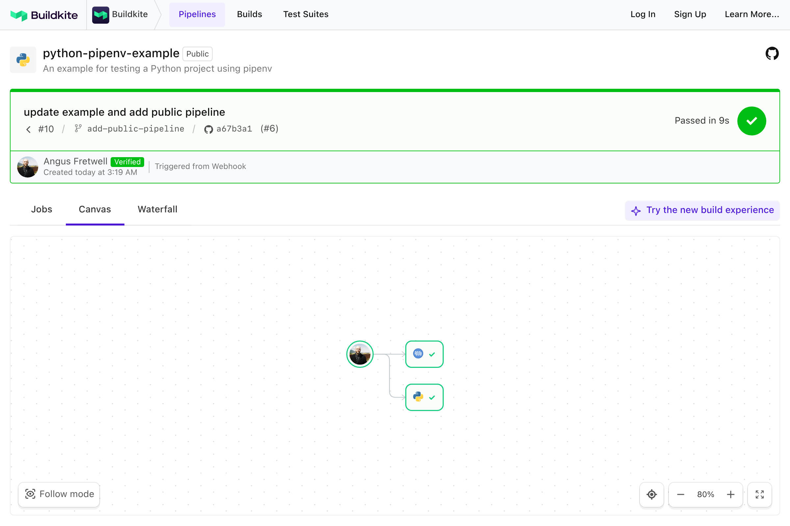

# Buildkite Python (pipenv) Example

[](https://buildkite.com/buildkite/python-pipenv-example/builds/latest?branch=main)
[](https://buildkite.com/new)

This repository is an example [Buildkite](https://buildkite.com/) pipeline that tests a [Python](https://python.org) project using [pipenv](https://github.com/kennethreitz/pipenv).

👉 **See this example in action:** [buildkite/python-pipenv-example](https://buildkite.com/buildkite/python-pipenv-example/builds/latest?branch=main)

See the full [Getting Started Guide](https://buildkite.com/docs/guides/getting-started) for step-by-step instructions on how to get this running, or try it yourself:

[](https://buildkite.com/new)

<a href="https://buildkite.com/buildkite/python-pipenv-example/builds/latest?branch=main">
  
</a>

<!-- docs:start -->

## How it works

This example:
- Assumes Python and pipenv are installed on the agent
- Installs dependencies with `pipenv install --deploy --dev`
- Runs tests using `pipenv run py.test`

Example pipeline step:
```yml
steps:
  - label: ":python: Test"
    commands:
      - pipenv install --deploy --dev
      - pipenv run py.test
```

> 💡 Looking for a Docker-based setup instead? Check out the [Python Docker Example](https://github.com/buildkite/python-docker-example).

<!-- docs:end -->

## License

See [LICENSE](LICENSE) (MIT)
