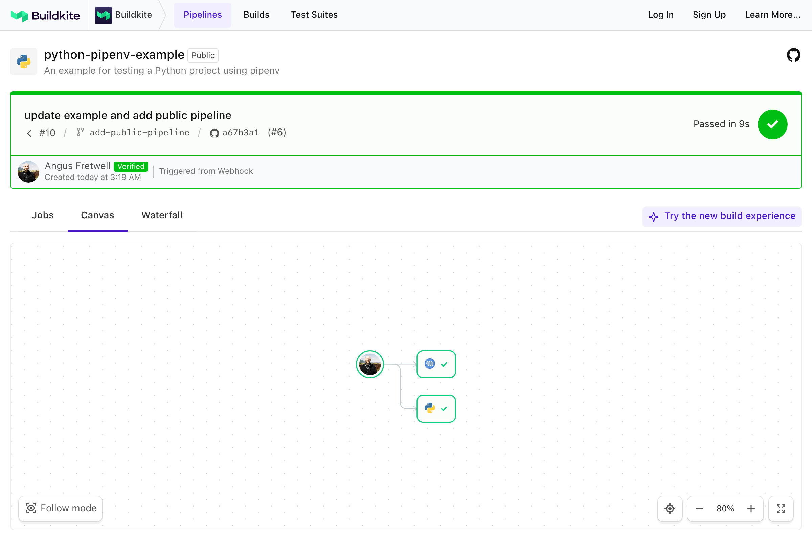

# Buildkite Python (pipenv) Example

[](https://buildkite.com/buildkite/python-pipenv-example)
[](https://buildkite.com/new)

This repository is an example for testing a [Python](https://python.org) project using [Buildkite](https://buildkite.com/) and [pipenv](https://github.com/kennethreitz/pipenv).

Note: this example assumes your Buildkite Agent machine has Python and pipenv already installed. See the [Python Docker Example](https://github.com/buildkite/python-docker-example) for running your Python project on any agent machine that has only Docker installed.

👉 **See this example in action:** [buildkite/python-pipenv-example](https://buildkite.com/buildkite/python-pipenv-example/builds/latest)

See the full [Getting Started Guide](https://buildkite.com/docs/guides/getting-started) for step-by-step instructions on how to get this running, or try it yourself:

[](https://buildkite.com/new)

<a href="https://buildkite.com/buildkite/python-pipenv-example/builds/latest?branch=main">
  
</a>

## How does it work?

The [pipeline.yml](.buildkite/pipeline.yml) installs your dependencies and runs [py.test](https://github.com/pytest-dev/pytest):

```yml
steps:
  - label: ":python: Test"
    commands:
      - pipenv install --deploy --dev
      - pipenv run py.test
```

## License

See [LICENSE](LICENSE) (MIT)
